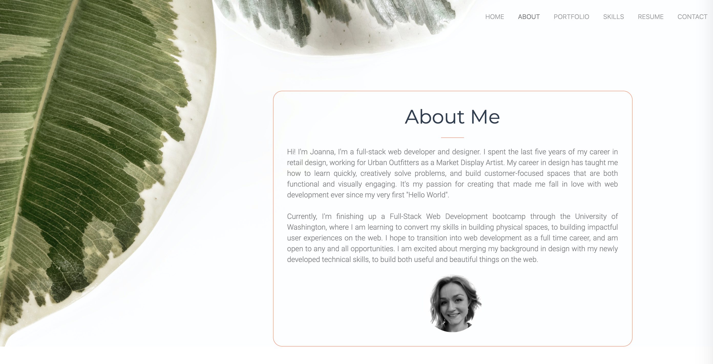
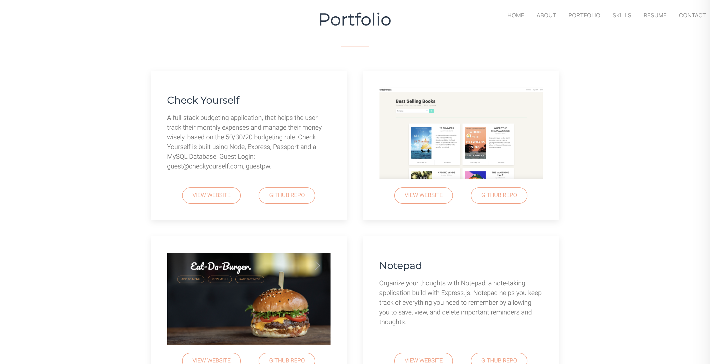
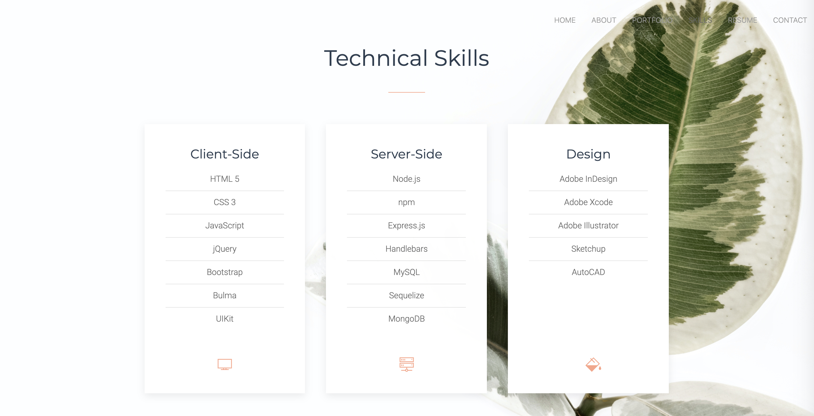

# [Web Development Portfolio](https://jpreston-alt.github.io/Portfolio-v3/)

## Objective
This site was built to showcase my web development portfolio. The goal for this webpage was to create a place where I could direct someone to find out a little more about me, see examples of my work, get access to my resume, LinkedIn profile, GitHub profile, and contact information.

In the third revamping of my portfolio I really wanted to focus on building a UI that aligned with my goal as a web developer: creating user-friendly applications that are both functional and pretty to look at. I wanted the design to feel clean and modern, while adding some cool functionality like off screen sliding elements, and the sliding portfolio images.

Since I've been spending so much time lately focusing on the back-end of web applications, I wanted to take this opportunity exercise my front-end skills and learn a new CSS Framework. Enter UIKit: an awesome, lightweight framework that achieves a simple and clean look. It even has some built in anaimation features and it's own icon library (yay!). I also tried out Animate.css, a css library that makes animating elements super simple. I learned alot, and had alot of fun with both UIKit and Animate.css, and will definitely be using both in the future!

 

 

## Table of Contents
* [Technologies](#technologies)
* [Usage](#usage)
* [Finished Product](#finished-product)
* [Credits](#Credits)
* [Questions](#questions)

## Technologies
* HTML
* CSS
* [UIKit](https://getuikit.com/)
* JavaScript
* jQuery
* [Animate.css](https://animate.style/)

## Usage
* Navigate to my [deployed portfolio.](https://jpreston-alt.github.io/Portfolio-v3/)
* Read about me in the About section.
* View my recent projects in the Portfolio section.
    * View project screenshot but clicking on the arrow in the right hand corner of the project card.
* View my technical skills in Skills section.
* View my Resume.
* Click "Contact" to view links to my LinkedIn and GitHub, as well as my email address and phone number.

## Finished Product
View deployed site [here](https://jpreston-alt.github.io/Portfolio-v3/).  

## Credits
* Background photo by [Scott Webb](https://www.pexels.com/@scottwebb) from Pexels.
* [OSTraining](https://www.youtube.com/watch?v=DXXh_dUHq3c) on YouTube for their tutorial on responsive menus with UIKit.

## Questions
​If you have any questions about the repo, please contact me:

On GitHub: [jpreston-alt](https://github.com/jpreston-alt) | Via Email: joannappreston@gmail.com